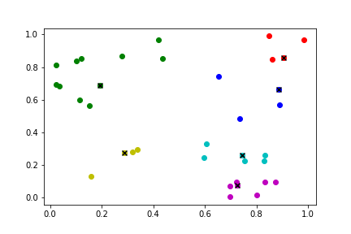

# K-Means with Batch

This piece of code is implemented for running k-means within a batch using Pytorch.

## Requirement
```
pytorch >= 1.8.2
matplotlib
```

## Applicability

Here is an example to show the case in which you might find this piece of code helpful. For example, if you have a tensor `points` with `shape=[12, 36, 2]`, indicating that the batch size is 12, there are 36 points in every data entry, and the dimension of points is 2, and you want to perform k-means within each data entry in the batch (12 entries in total), then this piece of code can work for you.

You also can choose to return cluster centers or centroids (the closest points to the centers).

Hope you find this helpful.

Here, we visulize the clustering result of the first data entry as an example (black 'x' denotes the centroids).


